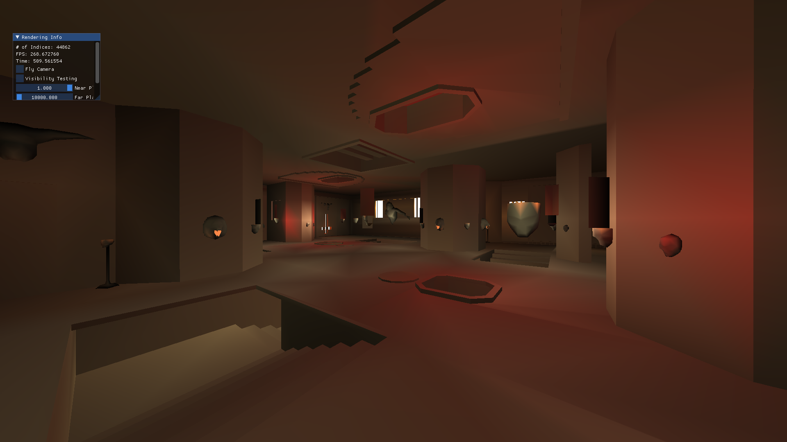

# Pléascach

###### Check out the raymarching branch (pléascach-dronuilleog)!

Small Vulkan 3D renderer.

#### List of 3rd party code included in this repository:
- Imgui (and Imgui-console): for debugging UI
- STB: for image loading
- GLM: for math
- GLFW: for cross-platform windowing
- TinyglTF: for glTF parsing

## Features
- glTF Model loading
- QuakeIII BSP Map Loading
- Tessellation-controlled heightmap terrains with dynamic normal calculation
- Working lighting!

## Short Term Changes
- Make index buffer device-local instead of host-coherent
	- Possibly restructure Buffer class to use templates to change
		constructor and functions to use staging buffers if needed.
## Constant Improvements
- Add more comments
## Long Term Improvements
- ~~Properly query surface to find supported formats for surfaces~~
- Fix all this cleanup vs destructor NONSENSE (inconsistency)
- Add pipeline caching
- Make more robust solution to window minimization (flushing out Input system should provide candidates)
- Command buffer per swapchain image
- Make smaller memory allocation object to pass around instead of directly passing physical device to everything